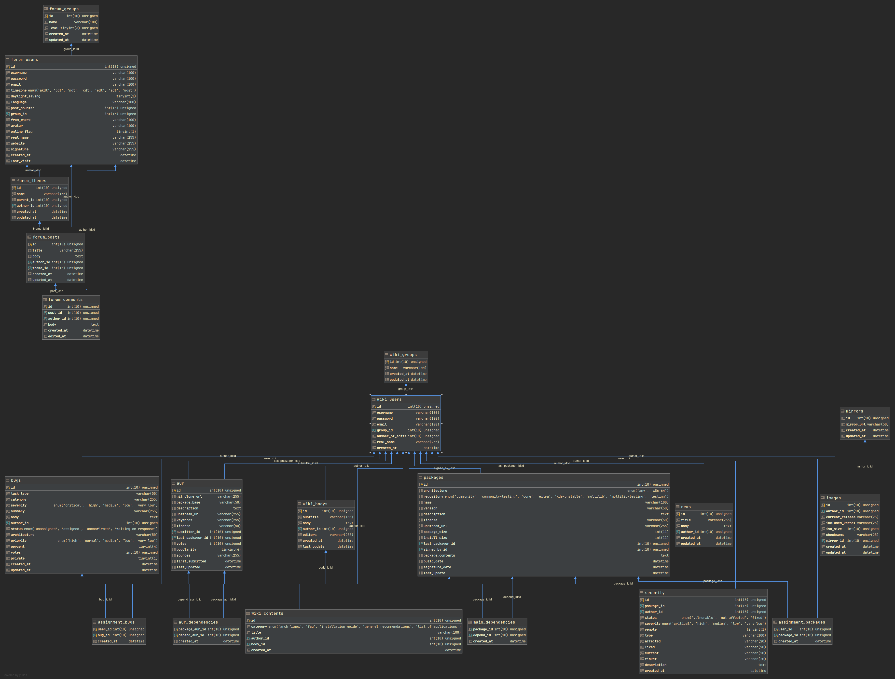

## Тренировочный проект на основе портала archlinux.org ##

Попытка создать базу данных archlinux.org, как она видна со стороны. Структура базы данных разделена на форумную подчасть и вики, пользователи между собой не пересекаются. Спорное решение, но так оно сделано в оригинале.

Что имеется в проекте:
- archlinux26082020.sql - Дамп базы
- archlinux.png - Диаграмма отношений
- data.sql - Данные. Относительно обработанные, хотя есть некоторые нюансы
- tables.sql - Таблицы
- key.sql, function.sql, triggers.sql etc - варианты функций, представлений, запросов и т.п.
- overview.txt - краткое описание имеющихся файлов

Создано все это богатство на MariaDB
